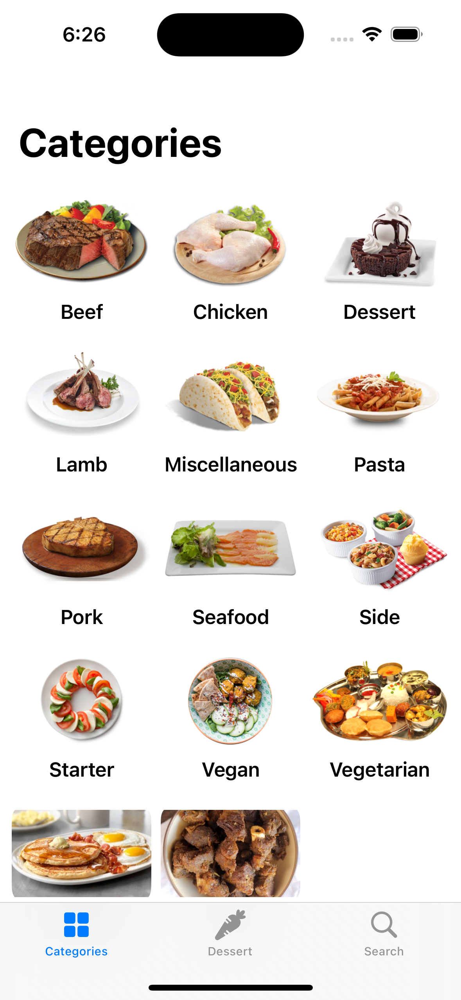
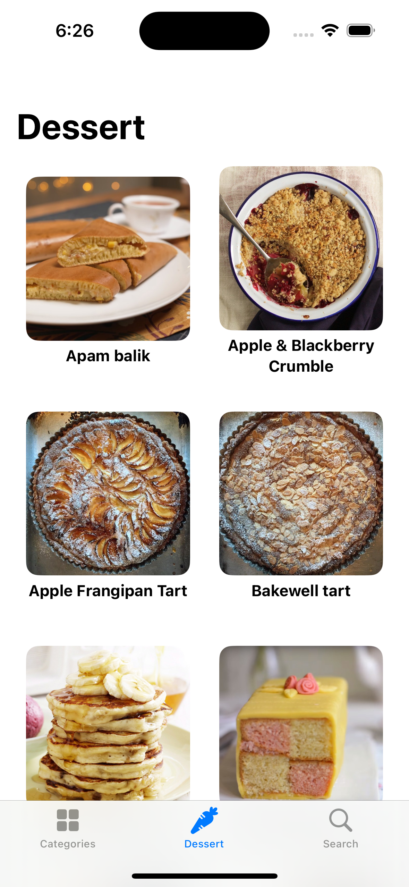
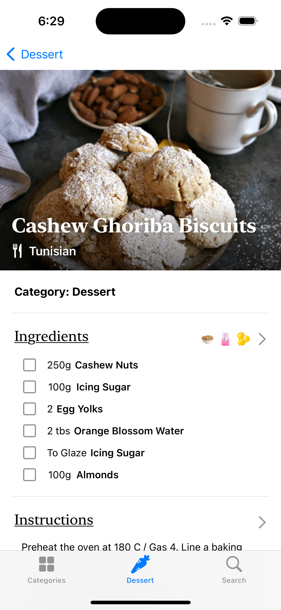
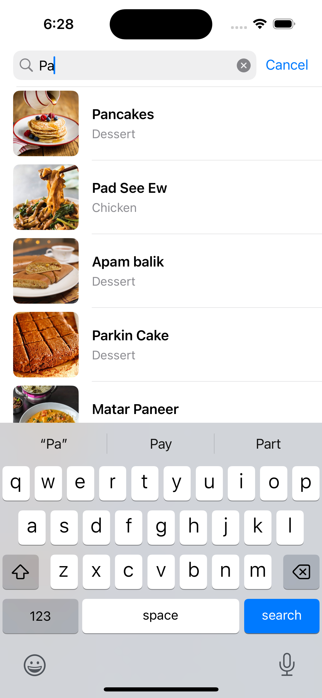

# PlatePath

**PlatePath** is an iOS app that allows users to browse different meal categories and view detailed recipes. It fetches meal data from the [TheMealDB API](https://www.themealdb.com/) and displays it in a user-friendly format.

## Features

- Browse meal categories (Dessert, Beef, etc.).
- Detailed meal information, including ingredients, measurements, and instructions.
- Meal videos via YouTube links.
- Smooth grid-based meal display with recipe thumbnails.

## Screenshots

  
  
  
  

## API Information

PlatePath uses the [TheMealDB API](https://www.themealdb.com/) to fetch meal and recipe data.

- **Meals by Category**: Display meals filtered by a specific category.
- **Meal Details**: Fetch and display detailed information about a meal, including ingredients and cooking instructions.

## Technical Details

### Architecture

**MVVM** (Model-View-ViewModel) architecture:
- **Model**: Represents the data fetched from the API (e.g., `Meal`, `Category`).
- **View**: SwiftUI views that display the meal data to the user.
- **ViewModel**: Handles fetching data via network calls and preparing it for the views.

### Testing

Unit tests are written for:
- **View Models**: Ensuring meal data is correctly fetched and updated.
- **Network Layer**: Verifying that API requests and responses are handled correctly.

## License

Licensed under the MIT License. See the [LICENSE](./LICENSE) file for more details.
